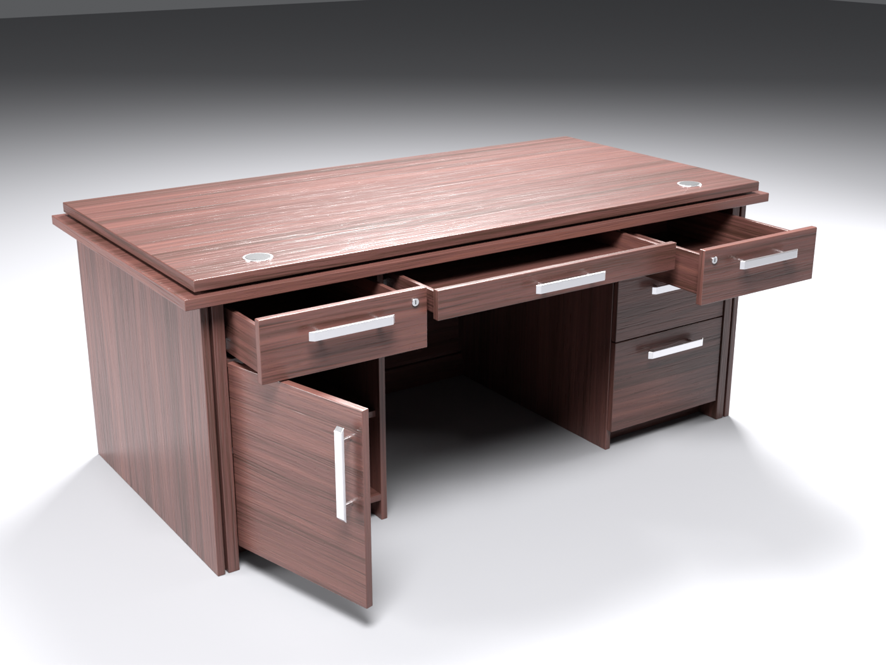

# Ofis stoli — Unity VR uchun 3D model (FBX)

Berilgan rasmdagi rahbar stoli asosida yaratilgan 3D model. Rasmda faqat old
(mehmon) tomoni ko'rinardi, orqa (o'tiruvchi) tomoni esa noldan loyihalandi.

| Old tomon (rasm asosida) | Orqa tomon (o'tiruvchi joyi) |
|---|---|
|  |  |
|  |  |

## Fayllar

| Fayl | Tavsif |
|---|---|
| `OfisStoli.fbx` | Asosiy model. Teksturalar ichiga joylangan (embedded) |
| `Textures/Wood_BaseColor.jpg` | Yog'och rangi, 2048², choksiz (tileable) |
| `Textures/Wood_Normal.png` | Normal xarita (OpenGL / Unity formati) |
| `Textures/Wood_Roughness.png` | Roughness (Blender, HDRP, Unreal uchun) |
| `Textures/Wood_MetallicSmoothness.png` | Unity Standard / URP Lit uchun: R = Metallic, A = Smoothness |
| `Unity/TortmaSlayder.cs` | VR da tortmani qo'l bilan tortib ochish uchun skript (ixtiyoriy) |
| `source/OfisStoli.blend` | Blender fayli (tahrirlash uchun) |
| `source/build_desk.py` | Modelni to'liq qayta yaratuvchi skript |
| `source/generate_textures.py` | Teksturalarni qayta yaratuvchi skript |
| `preview/` | Render rasmlar |

## Ranglar

- `#4A2F2A` — yog'ochning asosiy rangi (teksturaning o'rtacha rangi: `#4B2F2A`)
- `#331F19` — to'q tola chiziqlari

Tekstura to'g'ri tolali shpon: gorizontal tasmalar, ingichka tolalar, g'ovaklar
(pores) va yarim yaltiroq lak ko'rinishi. Bitta tekstura 2 × 2 m yuzani qoplaydi
(~1 px = 1 mm). Har bir detalda tola o'z yo'nalishida: stoleshnitsa va fasadlarda
gorizontal, yon oyoqlarda vertikal, tortma qutilarida chuqurlik bo'ylab.

## O'lchamlar

- Stoleshnitsa: **1.80 × 0.90 m**, balandlik **0.76 m**
- Umumiy gabarit (pastki plita bilan): 1.86 × 0.93 × 0.76 m
- Oyoq uchun bo'sh joy: 0.76 m kenglik, 0.62 m balandlik
- ~14 700 uchburchak, 3 ta material — VR (Quest ham) uchun yengil

## Orqa tomon (o'tiruvchi uchun)

O'tirgan odam nuqtai nazaridan:

- **O'ngda** — 3 ta tortmali tumba (yuqori tortmada qulf, pastkisi — chuqur
  hujjat/fayl tortmasi).
- **Chapda** — qulfli tortma va ichida tokchasi bor eshikli shkaf.
- **O'rtada** — yupqa qalam/klaviatura tortmasi va keng oyoq joyi.
- Tortmalarning ichki qutisi va metall yo'naltirgichlari bor — VR da ochilganda
  ichi bo'sh bo'lib ko'rinmaydi.
- Stoleshnitsada 2 ta kabel teshigi (grommet).
- Barcha qirralarda yumaloq faskalar (bevel), ular yorug'likni realistik aks ettiradi.

## Obyektlar (ierarxiya)

```
OfisStoli                (pivot: stol markazi, pol sathida)
├── Stol_Korpus          qo'zg'almas qism
├── Tortma_Ong_1         o'ng tumba, yuqori (qulfli)
├── Tortma_Ong_2         o'ng tumba, o'rta
├── Tortma_Ong_3         o'ng tumba, pastki (hujjat)
├── Tortma_Chap_1        chap tumba, yuqori (qulfli)
├── Tortma_Markaz        o'rta tortma
└── Eshik_Chap           chap shkaf eshigi (pivot — sharnir o'qida)
```

Unity'da (import qilingandan keyin):

| Obyekt | Harakat | Maksimum |
|---|---|---|
| `Tortma_Ong_1`, `Tortma_Ong_2`, `Tortma_Chap_1` | lokal **−Z** bo'ylab | 0.45 m |
| `Tortma_Ong_3` | lokal **−Z** bo'ylab | 0.50 m |
| `Tortma_Markaz` | lokal **−Z** bo'ylab | 0.35 m |
| `Eshik_Chap` | lokal **Y** o'qi atrofida | 0° … +100° |

Mehmon tomoni (rasmdagi old tomon) Unity'da **+Z** ga qaragan, o'tiruvchi
tomoni **−Z** da. Masshtab 1 = 1 metr, Rotation = 0, Scale = 1.

## Unity'ga import qilish

1. `ofis_stoli` papkasini to'liq `Assets/` ichiga tashlang (`OfisStoli.fbx` va
   `Textures/` birga turgani ma'qul).
2. `OfisStoli.fbx` ni tanlang → **Model** yorlig'i:
   - Scale Factor: `1`, Convert Units: ✔
   - Normals: `Import`, Tangents: `Calculate Mikktspace`
   - Baked yorug'lik ishlatsangiz: **Generate Lightmap UVs** ✔
3. **Materials** yorlig'i → **Extract Textures…**, so'ng **Extract Materials…**
   (materiallar tahrirlanadigan bo'ladi).
4. Materiallarni tekshiring (URP Lit yoki Standard):
   - `Yogoch_4A2F2A`: Base Map = `Wood_BaseColor`, Normal Map = `Wood_Normal`
     (Unity "Fix Now" desa — bosing), Metallic Map = `Wood_MetallicSmoothness`,
     Smoothness Source = *Metallic Alpha*.
   - `Metall_Alyuminiy`: rang `#CCCCD1`, Metallic `1`, Smoothness `0.7`.
   - `Plastik_Qora`: rang `#040404`, Smoothness `0.5`.
5. Modelni sahnaga torting.

### VR da tortma va eshikni ochish (ixtiyoriy)

Kolliderlar:
- `Stol_Korpus` ga bir nechta **Box Collider** qo'shing (stoleshnitsa, ikkala oyoq,
  old panel). Mesh Collider tavsiya etilmaydi — tortmalar bilan to'qnashadi.

Har bir tortma uchun:
1. **Box Collider** — faqat fasad va tutqichni qoplasin.
2. **Rigidbody** (Use Gravity o'chiq).
3. **XR Grab Interactable**: Movement Type = *Velocity Tracking*,
   Track Rotation ✘, Throw On Detach ✘.
4. `Unity/TortmaSlayder.cs` ni qo'shing va `maxOchilish` ni jadvaldagidek qo'ying.

Eshik uchun (`Eshik_Chap`):
1. Box Collider + Rigidbody (Use Gravity o'chiq) + XR Grab Interactable
   (Velocity Tracking).
2. **Hinge Joint**: Anchor `(0, 0, 0)`, Axis `(0, 1, 0)`, Use Limits ✔,
   Min `0`, Max `100`. Eshik teskari tomonga ochilsa — Min `-100`, Max `0`.

## Qayta yaratish

Blender 4.2 (yoki `pip install bpy==4.2.0`, Python 3.11) kerak:

```bash
python source/generate_textures.py      # teksturalar
python source/build_desk.py             # model + FBX + preview
python source/build_desk.py --no-render # faqat model + FBX
```

`build_desk.py` ning boshida barcha o'lchamlar (metrda) bor — stolni
kattalashtirish, tortmalar sonini o'zgartirish va hokazolar uchun o'sha yerni tahrirlang.
