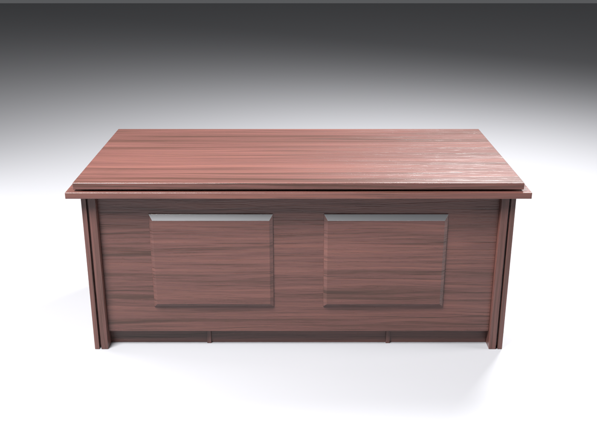
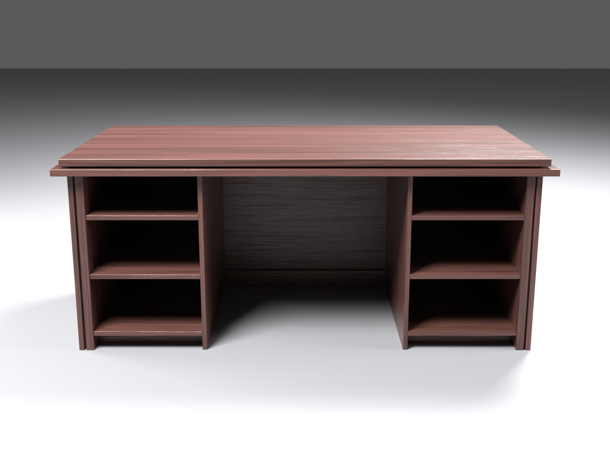
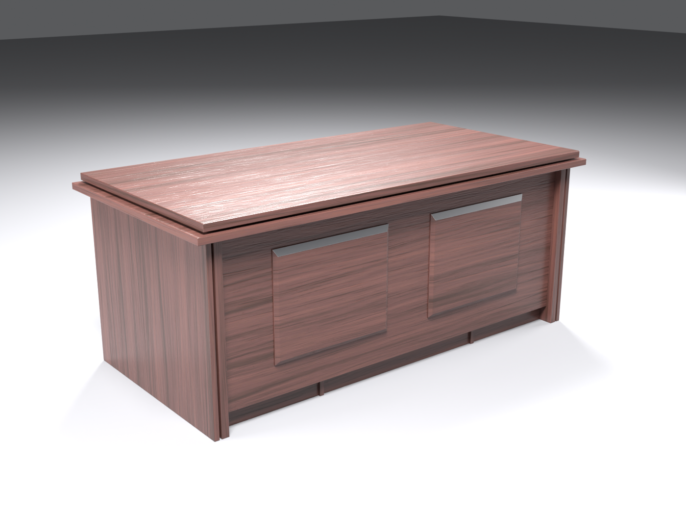
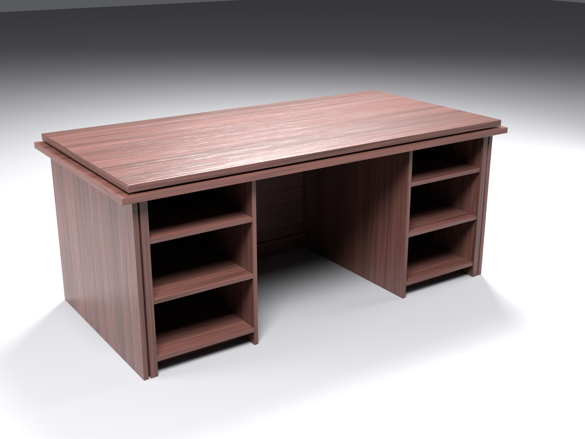

# Ofis stoli — Unity VR uchun 3D model (FBX)

Berilgan rasmdagi rahbar stoli asosida yaratilgan 3D model. Rasmda faqat old
(mehmon) tomoni ko'rinardi, orqa (o'tiruvchi) tomoni esa noldan loyihalandi.

| Old tomon (rasm asosida) | Orqa tomon (o'tiruvchi joyi) |
|---|---|
|  |  |
|  |  |

## Fayllar

| Fayl | Tavsif |
|---|---|
| `OfisStoli.fbx` | Asosiy model. Teksturalar ichiga joylangan (embedded) |
| `Textures/Wood_BaseColor.jpg` | Yog'och rangi, 2048², choksiz (tileable) |
| `Textures/Wood_Normal.png` | Normal xarita (OpenGL / Unity formati) |
| `Textures/Wood_Roughness.png` | Roughness (Blender, HDRP, Unreal uchun) |
| `Textures/Wood_MetallicSmoothness.png` | Unity Standard / URP Lit uchun: R = Metallic, A = Smoothness |
| `source/OfisStoli.blend` | Blender fayli (tahrirlash uchun) |
| `source/build_desk.py` | Modelni to'liq qayta yaratuvchi skript |
| `source/generate_textures.py` | Teksturalarni qayta yaratuvchi skript |
| `preview/` | Render rasmlar |

## Ranglar

- `#4A2F2A` — yog'ochning asosiy rangi (teksturaning o'rtacha rangi: `#4B2F2A`)
- `#331F19` — to'q tola chiziqlari

Tekstura to'g'ri tolali shpon: gorizontal tasmalar, ingichka tolalar, g'ovaklar
(pores) va yarim yaltiroq lak ko'rinishi. Bitta tekstura 2 × 2 m yuzani qoplaydi
(~1 px = 1 mm). Har bir detalda tola o'z yo'nalishida: stoleshnitsa va fasadlarda
gorizontal, yon oyoqlarda vertikal.

## O'lchamlar

- Stoleshnitsa: **1.80 × 0.90 m**, balandlik **0.76 m**
- Umumiy gabarit (pastki plita bilan): 1.86 × 0.93 × 0.76 m
- Oyoq uchun bo'sh joy: 0.76 m kenglik, 0.70 m balandlik
- ~2 600 uchburchak, 2 ta material — VR (Quest ham) uchun juda yengil

## Orqa tomon (o'tiruvchi uchun)

- Ikki yonda **ochiq tokchali tumbalar** — tortma va eshiksiz, har birida
  2 ta tokcha (3 ta bo'lim).
- O'rtada oyoq uchun keng bo'sh joy (0.76 m kenglik).
- Stoleshnitsa tekis — kabel teshiklari yo'q.
- Barcha qirralarda yumaloq faskalar (bevel), ular yorug'likni realistik aks ettiradi.

## Obyektlar

```
OfisStoli                (pivot: stol markazi, pol sathida)
└── Stol_Korpus          butun stol — bitta mesh
```

Mehmon tomoni (rasmdagi old tomon) Unity'da **+Z** ga qaragan, o'tiruvchi
tomoni **−Z** da. Masshtab 1 = 1 metr, Rotation = 0, Scale = 1.

## Unity'ga import qilish

1. `ofis_stoli` papkasini to'liq `Assets/` ichiga tashlang (`OfisStoli.fbx` va
   `Textures/` birga turgani ma'qul).
2. `OfisStoli.fbx` ni tanlang → **Model** yorlig'i:
   - Scale Factor: `1`, Convert Units: ✔
   - Normals: `Import`, Tangents: `Calculate Mikktspace`
   - Baked yorug'lik ishlatsangiz: **Generate Lightmap UVs** ✔
3. **Materials** yorlig'i → **Extract Textures…**, so'ng **Extract Materials…**
   (materiallar tahrirlanadigan bo'ladi).
4. Materiallarni tekshiring (URP Lit yoki Standard):
   - `Yogoch_4A2F2A`: Base Map = `Wood_BaseColor`, Normal Map = `Wood_Normal`
     (Unity "Fix Now" desa — bosing), Metallic Map = `Wood_MetallicSmoothness`,
     Smoothness Source = *Metallic Alpha*.
   - `Metall_Alyuminiy`: rang `#CCCCD1`, Metallic `1`, Smoothness `0.7`.
5. Modelni sahnaga torting.

### VR uchun kolliderlar

`Stol_Korpus` ga bir nechta **Box Collider** qo'shing (stoleshnitsa, ikkala
oyoq, old panel, ikkala tumba) yoki bitta **Mesh Collider** (Convex o'chiq) —
stol qo'zg'almas bo'lgani uchun ikkalasi ham ishlaydi.

## Qayta yaratish

Blender 4.2 (yoki `pip install bpy==4.2.0`, Python 3.11) kerak:

```bash
python source/generate_textures.py      # teksturalar
python source/build_desk.py             # model + FBX + preview
python source/build_desk.py --no-render # faqat model + FBX
```

`build_desk.py` ning boshida barcha o'lchamlar (metrda) bor — stolni
kattalashtirish, tokchalar sonini o'zgartirish va hokazolar uchun o'sha yerni tahrirlang.
