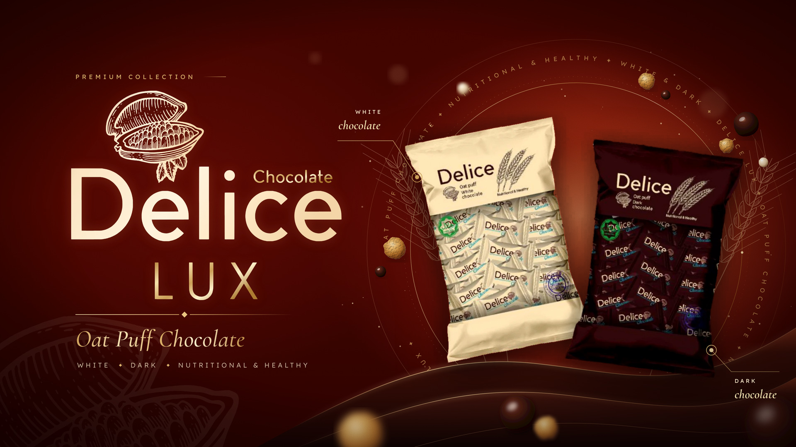

# Delice LUX — sayt header'i (16:9)

[delice-group.uz](https://delice-group.uz/) uchun "Delice LUX — Oat Puff Chocolate" posteri asosida tayyorlangan gorizontal header.



## Fayllar

| Fayl | O'lcham | Qayerda ishlatiladi |
|---|---|---|
| `delice-header-1920x1080.webp` / `.jpg` | 1920×1080 | Oddiy ekranlar (Full HD) |
| `delice-header-3840x2160.webp` / `.jpg` | 3840×2160 | Retina / 2K / 4K ekranlar |
| `assets/delice-lux-logo.svg` | vektor | Logotip, shaffof fonda; har qanday o'lchamda tiniq |
| `assets/delice-packs-transparent.png` | 1940×1476 | Ikki qadoq, shaffof fonda, soyasi bilan |
| `source/index.html` | — | Tahrirlanadigan manba (HTML/SVG) |

Sayt uchun WebP tavsiya etiladi: 1920×1080 versiyasi atigi ~170 KB.

## Saytga qo'yish

```html
<section class="hero">
  
</section>
```

```css
.hero img { display: block; width: 100%; height: auto; aspect-ratio: 16 / 9; object-fit: cover; }
```

## Dizayn

- Fon: brendning to'q bordo rangi (`#430400`), qadoqlar ortida iliq yorug'lik.
- Chap tomon: posterdagi logotip vektorga o'tkazilgan (kakao mevasi + Delice + Chocolate + LUX). "Chocolate" va "LUX" oltin rangda.
- O'ng tomon: qadoqlar fondan soyasi bilan birga ajratib olingan va AI (ESRGAN) yordamida 2 barobar tiniqlashtirilgan.
- Qadoqlar atrofida oltin halqa va aylana bo'ylab yozuv: "OAT PUFF CHOCOLATE ✦ NUTRITIONAL & HEALTHY ✦ WHITE & DARK ✦ DELICE LUX".
- Qo'shimcha bezaklar: chiziqli (gravyura uslubidagi) bug'doy boshoqlari, uchib yurgan oat puff va shokolad sharchalari, ostida suyuq shokolad to'lqini.
- Yuqoridagi ~150 px bo'sh qoldirilgan, shuning uchun saytning menyusi rasm ustida tursa ham hech narsani yopmaydi.

## Tahrirlash

Matnni (masalan, o'zbekcha shiorni) `source/index.html` ichida o'zgartiring, so'ng qayta render qiling:

```bash
cd source && node render.mjs   # ../delice-header-3840x2160.png chiqadi
```
