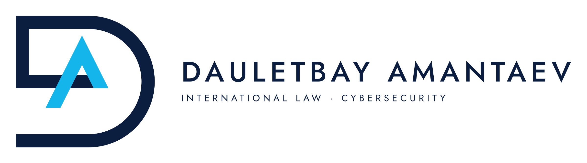
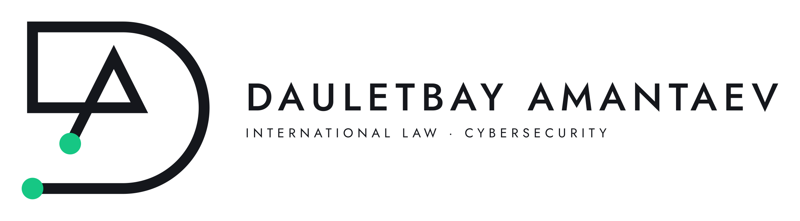
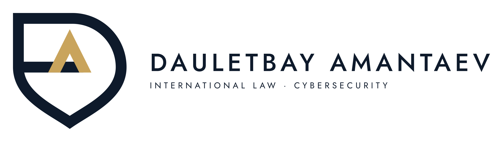
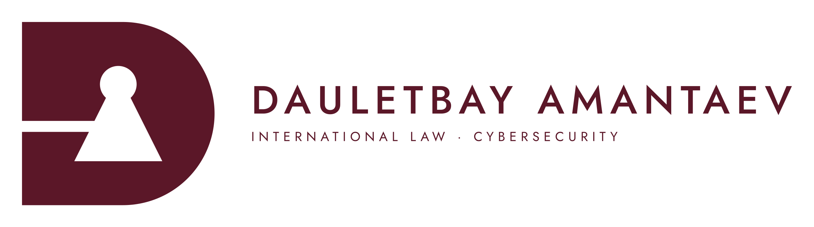
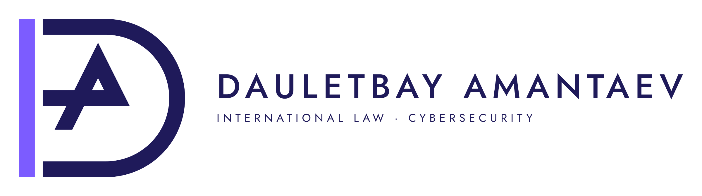
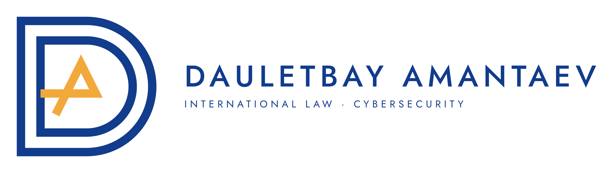

# Dauletbay Amantaev — logo rebrending

Yo'nalish: xalqaro huquq, kiberxavfsizlik, kiberzo'ravonlikka qarshi kurash.
Asl DA monogrammasi (A harfining chizig'i D ga tutashadi) saqlanib, bitta geometrik skeletga qayta chizildi.
Olti variant — bitta monogrammaning olti talqini:

| Variant | G'oya | Ranglar |
|---|---|---|
| **V1 Asl** | Evolyutsiya: asl g'oya, mukammal geometriya | `#0B1E3F` + `#13B5EA` |
| **V2 Uzluksiz** | Butun DA bitta chiziq, uchlari — sxema tugunlari | `#15171C` + `#16C784` |
| **V3 Qalqon** | D ning pastki yarmi qalqon uchiga aylanadi | `#0E1A2B` + `#C9A45C` |
| **V4 Kalit** | Yaxlit D, A — kalit teshigi va inson silueti | `#5B1728` + `#94A3B8` |
| **V5 Kursor** | "Code is Law": D ustuni — matn kursori | `#1F1A5A` + `#7C5CFF` |
| **V6 Iz** | Raqamli iz: ichma-ich D konturlari, markazda A | `#123C8C` + `#F2A93B` |








## Geometriya (hamma variantlar uchun umumiy)

- To'r 240 × 240 birlik, modul 10 (24 × 24 katak).
- Chiziq qalinligi 2 modul; chiziqli variantlarda 1,2 modul; tugun diametri = 2 × chiziq.
- D yoyi — aniq yarim aylana: markaz (130; 120), tashqi r = 100, ichki r = 80.
- A ning ko'ndalang chizig'i yoy markazidan (y = 120) o'tadi va D ustuniga tutashadi.
- A oyoqlari qiyaligi 1:2 (≈ 26,6°).

## Har bir variant papkasida

- `DA-Vx-Nom.ai` — Illustrator uchun PDF-mos fayl (bitta artboard: qurilish to'ri, ikonka, gorizontal, vertikal, invers, mono, ranglar).
- `DA-Vx-Nom.pdf` — xuddi shu varaq.
- `svg/` — 8 ta alohida vektor fayl, qatlamlar nomlangan (`ikonka`, `yozuv`, `ism`, `shior`, `fon`).
- `png/` — ikonka, ilova ikonkasi, avatar (1024 px), gorizontal (2400 px), vertikal (1600 px), `favicon.ico`.

Shrift: **Jost** (Google Fonts, OFL). Logodagi matn konturga aylantirilgan.
Shior: `INTERNATIONAL LAW · CYBERSECURITY` — `tools/gen.py` dagi `TAGLINE` orqali o'zgartiriladi.

## Qayta generatsiya

```bash
pip install fonttools uharfbuzz cairosvg pillow
# tools/fonts/ ga Jost[wght].ttf (Jost.ttf) va SpaceGrotesk[wght].ttf (SpaceGrotesk.ttf) qo'ying
cd tools && python3 gen.py --dist _dist && python3 page.py _dist
```
