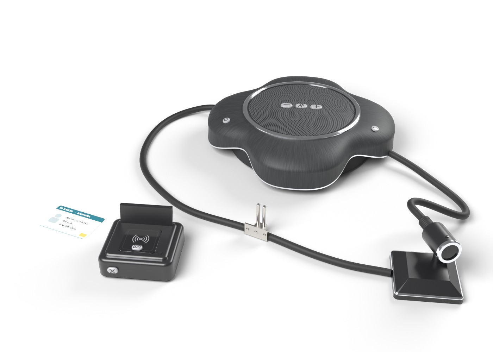
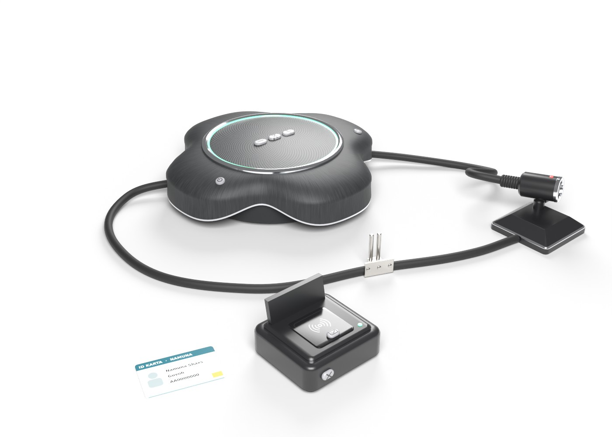

# Sud zali audio-video tizimi — Unity VR uchun 3D model

Rasmdagi to'plam: konferensiya spikerfoni (mikrofon massivi + karnay), tagligidagi videokamera,
NFC ID-karta o'quvchisi va kabel qisqichi. Qurilmalar sud zalidagi vazifalarini bajaradi:
majlisni ovozli yozish, videokonferensiya, ishtirokchini ID karta orqali tasdiqlash.
Hammasi `Unity/Scripts` dagi skriptlar bilan ishlaydi.




Ranglar rasmdagidek: grafit-qora korpus, xrom halqalar, po'lat qisqich. Qurilmada yog'och qism
yo'q, shuning uchun `#4A2F2A` / `#331F19` yog'och ranglari qo'llanmagan.

## Fayllar

| Fayl | Tavsif |
| --- | --- |
| `CourtAVSystem.fbx` | Asosiy model (teksturalar ichiga joylangan) |
| `Textures/Shell_BaseColor.png`, `Shell_Normal.png` | Korpus: mayda teri/tola naqshli grafit |
| `Textures/Grille_BaseColor.png`, `Grille_Normal.png` | Karnay to'ri (spiral teshiklar) |
| `Textures/Buttons_Icons.png` | Tugma belgilari: ovoz −/+, mikrofon, quvvat, qo'ng'iroq, tasdiqlash, tozalash |
| `Textures/NFC_Pad.png` | O'quvchi maydonchasi, NFC belgisi |
| `Textures/IdCard.png` | Namuna ID karta (shartli ma'lumotlar) |
| `Unity/Scripts/*.cs` | Qurilma funksiyalari (namespace `CourtAV`) |
| `preview_off.jpg`, `preview_on.jpg` | Render ko'rinishlari |
| `generate_court_av.py` | Modelni qayta yaratuvchi Blender skripti |

## Model parametrlari

- 1 unit = 1 metr, Y yuqoriga. Unity'da hamma obyektlarning rotation qiymati 0.
- Spikerfon: Ø333 mm, balandligi 82 mm (to'rt yaproqli korpus).
- Kamera tagligi bilan: 92 × 120 mm, balandligi 76 mm.
- ID o'quvchi: 106 × 102 mm, balandligi 66 mm.
- ID karta: 85.6 × 54 mm (ISO ID-1). O'quvchini ishlatish uchun qo'shilgan, rasmda yo'q.
  Kerak bo'lmasa, `IdCard` obyektini o'chirib yuboring.
- Butun to'plam stolda: 663 × 559 mm.
- 19 584 uchburchak, 21 obyekt, 14 material, 7 tekstura.
- Ierarxiya:
  - `CourtAVSystem`
    - `Speakerphone`
      - `Speakerphone_Grille`, `Speakerphone_ChromeRing`
      - `Speakerphone_LEDRing` (holat halqasi)
      - `Btn_VolumeDown`, `Btn_Mute`, `Btn_VolumeUp`, `Btn_Power`, `Btn_Call`
    - `CameraBase`
      - `Camera_Head`: pivot bo'g'imda, obyektiv local **+Z** bo'ylab qaraydi
        - `Camera_RecLED`
    - `IdReader`
      - `IdReader_Pad`: NFC maydoncha
      - `IdReader_LED`, `Btn_ReaderConfirm`, `Btn_ReaderClear`
    - `IdCard`
    - `Cable_A`, `Cable_B`, `CableClamp`

  Har bir tugmaning pivoti tugma asosida. Local Y sirt normali bo'ylab, shuning uchun tugma
  shu o'q bo'ylab botadi.

## Sud zalidagi funksiyalar

| Tugma | Funksiya |
| --- | --- |
| **Quvvat** (spikerfon chap tomonida) | Majlis ochiladi: mikrofon ovozni WAV faylga yozadi (audio protokol). Qayta bosilsa, yozuv yopiladi va saqlanadi. |
| **Mikrofon** (tepada, o'rtada) | Mikrofon o'chiriladi. Yozuvga sukunat tushadi, shuning uchun vaqt chizig'i uzilmaydi. |
| **Ovoz − / +** | Karnay ovozi 10% qadam bilan. |
| **Qo'ng'iroq** (o'ng tomonda) | Videokonferensiya: tomon yoki guvoh masofadan qatnashadi. Kamera tasvirni `RenderTexture` ga beradi (monitorga chiqarish mumkin). REC chirog'i qizil miltillaydi. Masofadagi ishtirokchi ovozi karnaydan eshitiladi. |
| **ID karta → NFC maydoncha** | Ishtirokchi shaxsi tasdiqlanadi: chiroq yashil yonadi va ikki marta signal chalinadi. `onIdentified` hodisasi "Shaxs tasdiqlandi: F.I.Sh. (roli), hujjat …" matnini beradi. |
| **Tasdiqlash** (o'quvchi tepasida) | Oxirgi tasdiqlangan shaxsni qayta e'lon qiladi. Karta o'qilmagan bo'lsa, chiroq to'q sariq miltillaydi. |
| **Tozalash** (o'quvchi old tomonida) | O'quvchi holatini tozalaydi. |

Tugmasiz, koddan chaqiriladigan funksiya: `CourtCamera.SaveSnapshot()` kamera kadrini PNG qilib
saqlaydi (majlisning foto qaydi).

Spikerfon halqasining ranglari:

| Rang | Holat |
| --- | --- |
| o'chiq | quvvat o'chiq |
| yashil | majlis yozilmoqda |
| ko'k | videokonferensiya |
| qizil | mikrofon o'chirilgan |
| oq, 1 soniya | ovoz darajasi o'zgardi |

Fayllar `Application.persistentDataPath` ichiga saqlanadi:
- `CourtRecordings/majlis_YYYYMMDD_HHMMSS.wav` — majlis yozuvi, 16 kHz, 16-bit.
- `CourtSnapshots/kadr_YYYYMMDD_HHMMSS.png` — kamera kadri.

Windows'da bu `%USERPROFILE%\AppData\LocalLow\<Company>\<Product>\` papkasi.

## Unity'ga o'rnatish

1. `CourtAVSystem.fbx` ni `Assets/` ichiga, `Unity/Scripts` papkasini ham `Assets/` ichiga tashlang.
2. Modelni sahnaga qo'ying va ildiz obyekt `CourtAVSystem` ga **`CourtAVSystem`** komponentini qo'shing.
   Qolganini u o'zi bajaradi: `Play` bosilganda qismlarni nomi bo'yicha topadi va quyidagilarni qo'shadi:
   - skriptlar, collider'lar va audio manbalar;
   - har bir tugmaga trigger `BoxCollider` va `DeviceButton`;
   - NFC maydonchaga trigger zona;
   - ID kartaga `BoxCollider`, `Rigidbody` va `IdCard` (F.I.Sh., rol, hujjat raqami — Inspector'da o'zgartiriladi).
3. `CourtAVSystem` komponentidagi ixtiyoriy maydonlar:
   - `Monitor Screen` — sahnadagi monitor (masalan Quad). Videokonferensiyada kamera tasviri shunga chiqadi.
   - `Remote Participant Audio` — masofadagi ishtirokchi ovozi (AudioClip).
   - `Record Audio` — majlisni WAV ga yozish (standart: yoqilgan).
   - `Power On At Start` — sahna boshlanishida spikerfonni yoqish.
4. Mikrofon ruxsati:
   - Meta Quest / Android: ilova boshlanishida
     `UnityEngine.Android.Permission.RequestUserPermission(UnityEngine.Android.Permission.Microphone)` chaqiring.
   - Windows (PC VR): *Settings → Privacy → Microphone* da ilovalarga ruxsat bo'lsin.

   Mikrofon topilmasa, yozuvsiz ishlaydi va Console'ga ogohlantirish chiqadi. WebGL'da Unity `Microphone` ishlamaydi.
5. Chiroqlar Built-in Standard va URP Lit shaderlarida `_EmissionColor` orqali yonadi.
   URP'da material pushti bo'lsa: *Window → Rendering → Render Pipeline Converter*.

### VR'da ishlatish (XR Interaction Toolkit)

- **Tugmalar.** Ikki usuldan birini tanlang:
  - Barmoq uchiga yoki kontrollerga kichik `Sphere Collider` va `Rigidbody` (Is Kinematic ✔) qo'shing.
    Rigidbody'li collider tugma triggeriga tegsa, tugma bosiladi.
    Faqat barmoq bossin desangiz, unga teg bering (masalan `Finger`) va tugmalardagi `DeviceButton.presserTag` ga shu tegni yozing.
  - Yoki tugmaga `XR Simple Interactable` qo'shing va *Select Entered* hodisasiga `DeviceButton.Press()` ni ulang.
- **ID karta.** `IdCard` ga `XR Grab Interactable` qo'shing (Rigidbody allaqachon bor). Kartani olib,
  o'quvchi maydonchasiga qo'ysangiz, shaxs tasdiqlanadi. Karta tugmalarni bosib yubormaydi.
- **Kamera.** `Camera_Head` bo'g'imda aylanadi. Uni sudlanuvchi yoki guvoh tomonga burish uchun
  `XR Grab Interactable` (Track Position ✘, Rigidbody: Is Kinematic ✔) qo'shish mumkin. Kamera tasviri VR shlemga chiqmaydi,
  faqat `RenderTexture` ga yoziladi.
- Editor'da sichqoncha bilan tugmani bosish ham ishlaydi (`OnMouseDown`).

### Boshqa tizimlarga ulash

Hodisalar Inspector'da yoki koddan ulanadi:
- `CourtSpeakerphone`:
  - `onPowerChanged(bool)`, `onMuteChanged(bool)`, `onCallChanged(bool)`;
  - `onRecordingSaved(string path)` — WAV fayl yo'li.
- `IdCardReader`: `onIdentified(string)`, `onCleared`.

Masalan, `onIdentified` ni majlis bayonnomasi UI'siga, `onRecordingSaved` ni arxivga ulash mumkin.

| Skript | Vazifasi |
| --- | --- |
| `CourtAVSystem.cs` | Ildizdagi sozlovchi: qismlarni topadi, komponentlarni qo'shadi, tugmalarni ulaydi |
| `CourtSpeakerphone.cs` | Quvvat, yozuv (WAV), mikrofonni o'chirish, ovoz, videokonferensiya, halqa ranglari |
| `CourtCamera.cs` | Kamera: `RenderTexture` oqimi, REC chirog'i, `SaveSnapshot()` |
| `IdCardReader.cs`, `IdCard.cs` | NFC o'quvchi va karta ma'lumotlari |
| `DeviceButton.cs` | Jismoniy tugma: bosilish, botish animatsiyasi, `onPressed` |
| `LedIndicator.cs` | Chiroq: rang, emission, miltillash |
| `WavWriter.cs` | Oqimli 16-bit PCM WAV yozuvchi |
| `CourtAVEvents.cs` | `BoolEvent`, `StringEvent`, signal ohanglari generatori |

> Skriptlar C# kompilyatorida UnityEngine API'si bo'yicha tekshirildi, `WavWriter` chiqargan fayl
> alohida sinovdan o'tdi. Unity Editor va VR shlemda sinab ko'rilmagan.

## Qayta generatsiya qilish

Ranglar skript boshidagi `COLORS` va `make_textures()` ichida, joylashuv `SPK`, `CAMB`, `DOCK`, `CARD` da:

```bash
pip install bpy==4.2.0 numpy pillow
python3 generate_court_av.py --render        # FBX + teksturalar + preview rasmlar
```
