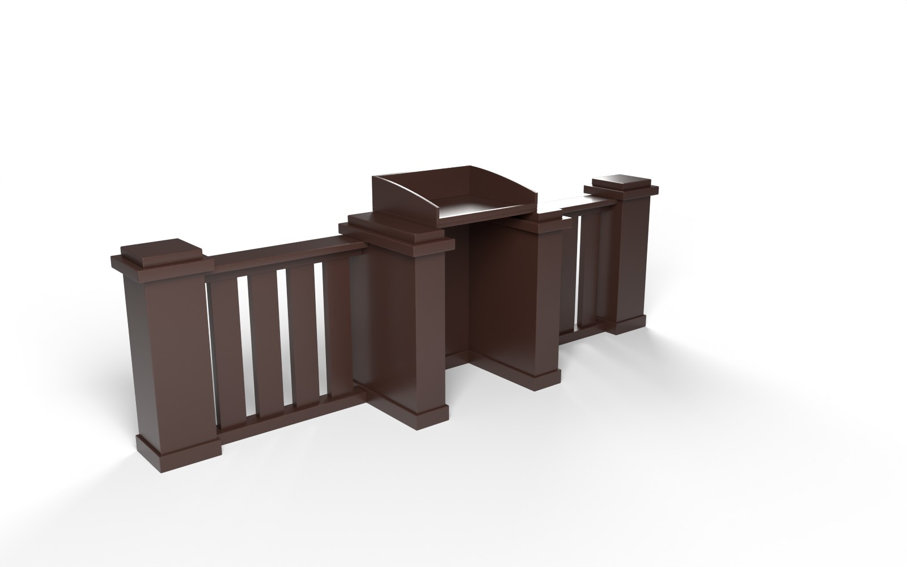
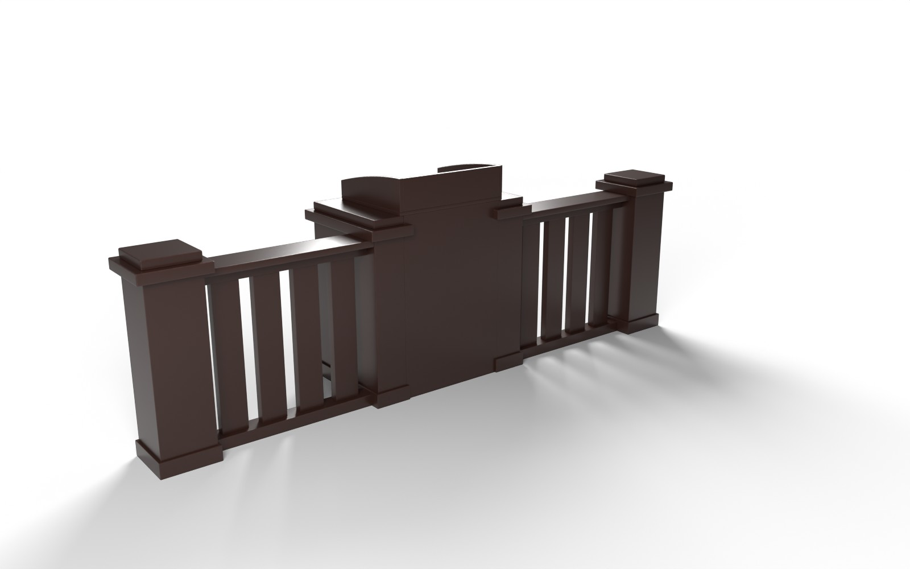

# Sud zali to'sig'i (guvoh joyi bilan) — Unity VR uchun 3D model

Rasmdagi yog'och to'siq: ikki chetida qalpoqli ustunlar, orasida yassi taxtali bo'laklar,
o'rtada guvoh (so'zlovchi) turadigan joy va uning tepasida stol.




## Kesilgan joylar qanday to'ldirildi

Rasmda fon olib tashlanganda to'siqning bir qismi kesilib ketgan. Ular shunday tiklandi:

- **Taxtali bo'laklar:** chap va o'ng bo'laklarning pastki qismi yo'q edi. Taxtalar pastki reykagacha
  (polgacha) davom ettirildi, har bo'lakda 4 ta, bir xil oraliq bilan.
- **O'rta qism:** stol ostidagi hamma narsa kesilgan edi. Ikki chuqur ustun polgacha tushirildi va
  chetdagi ustunlar kabi pastki taglik (plintus) bilan tugallandi. Sud tomonida polgacha orqa panel
  qo'yildi. Guvoh tomoni (oldi) ochiq qoldirildi, chunki rasmda ichki burchaklar ko'rinib turibdi.
- **Stol:** rasmdagidek deyarli kvadrat (0.75 × 0.62 m). Orqa taxtasi baland (0.21 m), yon taxtalarning ustki qirrasi
  orqada tekis boshlanib oldinga tobora pasayadi, oldingi uchi taxminan yarim balandlikda qoladi; oldida past lab.
  Stol ustunlar ustida, orqa panel bilan bir tekisda turadi.

## Fayllar

| Fayl | Tavsif |
| --- | --- |
| `CourtBarrier.fbx` | Asosiy model (teksturalar ichiga joylangan) |
| `Textures/Barrier_Wood_BaseColor.jpg` | Yog'och rangi, 2048×2048: asosiy `#4A2F2A`, tolalar `#331F19` |
| `Textures/Barrier_Wood_Normal.png` | Normal map (OpenGL / Unity formati) |
| `preview_front.jpg`, `preview_court.jpg` | Render ko'rinishlari |
| `generate_barrier.py` | Modelni qayta yaratuvchi Blender skripti |

## Model parametrlari

- Uzunligi **3.70 m** (qalpoq va plintuslar bilan 3.78 m), to'siq balandligi **1.00 m**, ustun qalpoqlari 1.11 m, stol orqa taxtasi 1.32 m.
- Chuqurligi: to'siq 0.30 m; guvoh joyi 0.66 m (+Z tomonga chiqib turadi). Stol 0.75 × 0.62 m, orqa panel bilan bir tekisda, hech tomonga osilib chiqmaydi.
- Guvoh turadigan ochiq joy kengligi 0.70 m.
- 1 unit = 1 metr. Unity'da rotation `0,0,0`, scale `1,1,1`. Pivot polda, to'siq chizig'ining markazida.
- Guvoh joyi **+Z** (Unity forward) tomonga ochiladi; sud −Z tomonda.
- 4 420 uchburchak, 1 material (`Barrier_Wood`), 2 tekstura. Tola ustun va taxtalarda vertikal,
  reyka, qalpoq va stolda gorizontal.
- Ierarxiya: `CourtBarrierSet` → `CourtBarrier`.

## Unity'ga import qilish

1. `CourtBarrier.fbx` ni `Assets/` ichiga tashlang. Teksturalar avtomatik ulanadi.
   Materialni tahrirlash kerak bo'lsa, **Materials** tabida `Extract Textures…` / `Extract Materials…` bosing.
2. `Barrier_Wood` materiali: Smoothness ≈ 0.6. Normal map teksturasining turi *Normal map* bo'lsin.
   URP'da material pushti bo'lsa: *Window → Rendering → Render Pipeline Converter*.
3. VR'da o'tib ketmaslik uchun: **Model** tabida `Generate Colliders` ✔.
4. Obyektni **Static** qiling.

## Qayta generatsiya qilish

Skript boshidagi ranglar (`WOOD_LIGHT`, `WOOD_DARK`) va o'lchamlar (`SECTION`, `SLATS`, `SLAT`,
`OPENING`, `PIER`, `TRAY`, `POST`, `POST_H`) o'zgartiriladi:

```bash
pip install bpy==4.2.0 numpy pillow
python3 generate_barrier.py --render        # FBX + teksturalar + preview rasmlar
```
