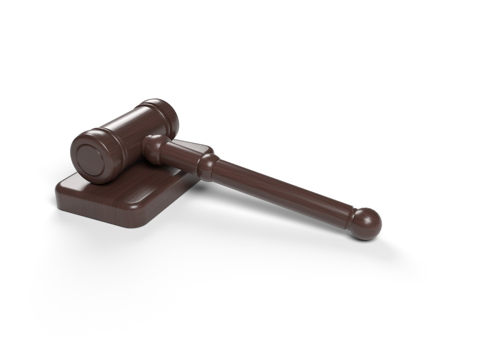
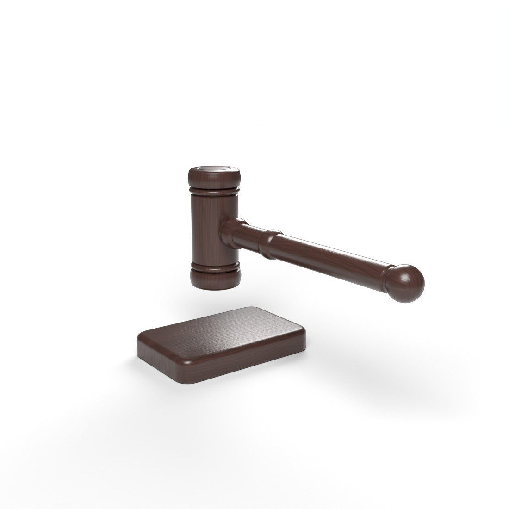

# Sudya bolg'asi va taglik — Unity VR uchun 3D model

Rasmdagi sudya bolg'asi (gavel) va uning to'rtburchak tagligi. Ikkalasi **alohida obyekt**:
VR'da bolg'ani qo'lga olib, taglikka urish mumkin.




## Fayllar

| Fayl | Tavsif |
| --- | --- |
| `JudgeGavel.fbx` | Asosiy model (teksturalar ichiga joylangan) |
| `Textures/Gavel_Wood_BaseColor.jpg` | Yog'och rangi, 2048×2048: asosiy `#4A2F2A`, tolalar `#331F19` |
| `Textures/Gavel_Wood_Normal.png` | Normal map (OpenGL / Unity formati) |
| `preview_rest.jpg`, `preview_strike.jpg` | Render ko'rinishlari |
| `generate_gavel.py` | Modelni qayta yaratuvchi Blender skripti |

## Model parametrlari

- 1 unit = 1 metr, Y yuqoriga.
- Bolg'a: umumiy uzunligi 315 mm, kallagi 130 mm × Ø57 mm, dastasi Ø25 mm, oxirida Ø31 mm shar.
- Taglik: 170 × 110 × 26 mm, burchaklari va ustki qirrasi yumaloqlangan.
- 7 436 uchburchak, 1 material (`Gavel_Wood`), 2 tekstura.
- Ierarxiya:
  - `JudgeGavelSet`
    - `Gavel` — pivot **dastani ushlash joyida** (kallak o'qidan 190 mm).
      Local Z dasta bo'ylab kallak tomonga, local Y kallak (urish) o'qi bo'ylab.
      Faylda bolg'a rasmdagidek taglik ustida yotgan holatda turadi.
    - `SoundBlock` — pivot tagining markazida, rotation 0.

## Unity'ga import qilish

1. `JudgeGavel.fbx` ni `Assets/` ichiga tashlang. Teksturalar avtomatik ulanadi.
   Materialni tahrirlash kerak bo'lsa, **Materials** tabida `Extract Textures…` / `Extract Materials…` bosing.
2. `Gavel_Wood` materiali: Smoothness ≈ 0.7 (laklangan yog'och). Normal map teksturasining turi *Normal map* bo'lsin.
   URP'da material pushti bo'lsa: *Window → Rendering → Render Pipeline Converter*.

### VR'da bolg'ani ko'tarib urish (XR Interaction Toolkit)

**`Gavel`**:
- `Rigidbody`: Mass ≈ 0.35, Collision Detection = **Continuous Dynamic** (tez urishda taglikdan o'tib ketmasligi uchun).
- `Mesh Collider`: **Convex ✔**.
- `XR Grab Interactable`: Movement Type = **Velocity Tracking**, shunda zarba fizik bo'ladi.
  Attach Transform bo'sh qolsa ham bo'ladi, chunki pivot allaqachon ushlash joyida.

**`SoundBlock`**:
- `Box Collider`. Taglik qimirlamasin desangiz, Rigidbody qo'shmang (yoki `Is Kinematic ✔`).

## Qayta generatsiya qilish

Skript boshidagi ranglar (`WOOD_LIGHT`, `WOOD_DARK`) va o'lchamlar (`HEAD_HALF`, `HANDLE_LEN`, `GRIP`, `BLOCK`) o'zgartiriladi:

```bash
pip install bpy==4.2.0 numpy pillow
python3 generate_gavel.py --render        # FBX + teksturalar + preview rasmlar
```
