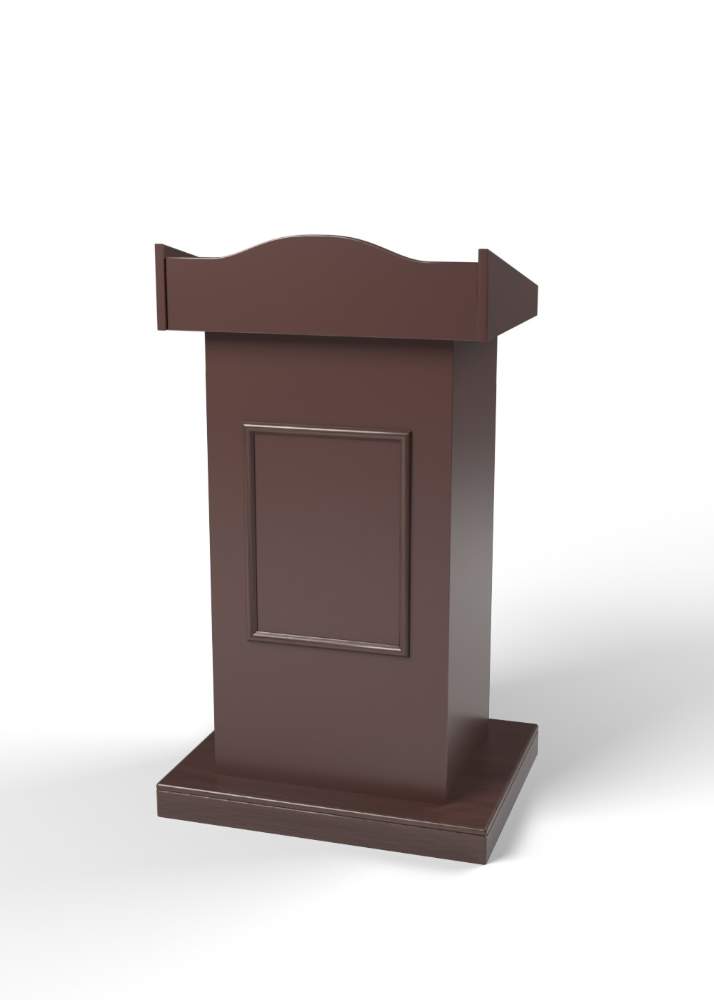
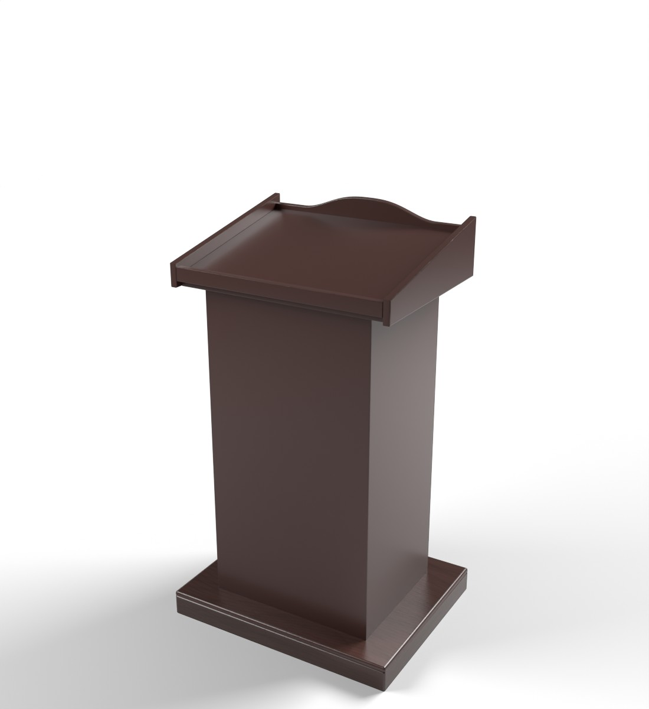

# Yog'och tribuna — Unity VR uchun 3D model

Rasmdagi yog'och tribuna (minbar): ikki pog'onali taglik, old tomonida ramkali (molding)
bezak panel, tepada o'rtasi qavariq old taxtali kitob stoli, qiya yon taxtalar va qiya
o'qish yuzasi.




## Fayllar

| Fayl | Tavsif |
| --- | --- |
| `Lectern.fbx` | Asosiy model (teksturalar ichiga joylangan) |
| `Textures/Lectern_Wood_BaseColor.jpg` | Yog'och rangi, 2048×2048, tile qilinadi: asosiy `#4A2F2A`, tolalar `#331F19` |
| `Textures/Lectern_Wood_Normal.png` | Normal map (OpenGL / Unity formati) |
| `preview_front.jpg`, `preview_back.jpg` | Render ko'rinishlari |
| `generate_lectern.py` | Modelni qayta yaratuvchi Blender skripti |

## Model parametrlari

- O'lcham: **700 × 560 mm**, balandligi **1195 mm** (toj uchida); old taxta chetlari 1150 mm,
  o'qish yuzasi orqa tomonda 1045 mm, oldinda 1135 mm. 1 unit = 1 metr.
- Unity'da rotation `0,0,0`, scale `1,1,1`. Pivot polda, taglik markazida.
- Bezakli old tomoni **+Z** (Unity forward) tomonga qaragan; so'zlovchi orqa (−Z) tomonda turadi.
- 1 412 uchburchak, 1 material (`Lectern_Wood`), 2 tekstura. Yog'och tolasi korpusda vertikal,
  taglik va stolda gorizontal.
- Ierarxiya: `LecternSet` → `Lectern`.
- O'qish yuzasining orqa qirrasida qog'oz sirg'alib tushmasligi uchun 2 sm to'siq bor.

## Unity'ga import qilish

1. `Lectern.fbx` ni `Assets/` ichiga tashlang. Teksturalar avtomatik ulanadi.
   Materialni tahrirlash kerak bo'lsa, **Materials** tabida `Extract Textures…` / `Extract Materials…` bosing.
2. `Lectern_Wood` materiali: Smoothness ≈ 0.65. Normal map teksturasining turi *Normal map* bo'lsin.
   URP'da material pushti bo'lsa: *Window → Rendering → Render Pipeline Converter*.
3. VR'da ustiga narsa qo'yish yoki to'qnashuv uchun: **Model** tabida `Generate Colliders` ✔.
4. Obyektni **Static** qiling.

## Qayta generatsiya qilish

Skript boshidagi ranglar (`WOOD_LIGHT`, `WOOD_DARK`) va o'lchamlar (`BASE`, `BODY`, `DESK`, `DESK_Y`,
`APRON_TOP`, `CREST`, `PANEL`) o'zgartiriladi:

```bash
pip install bpy==4.2.0 numpy pillow
python3 generate_lectern.py --render        # FBX + teksturalar + preview rasmlar
```
