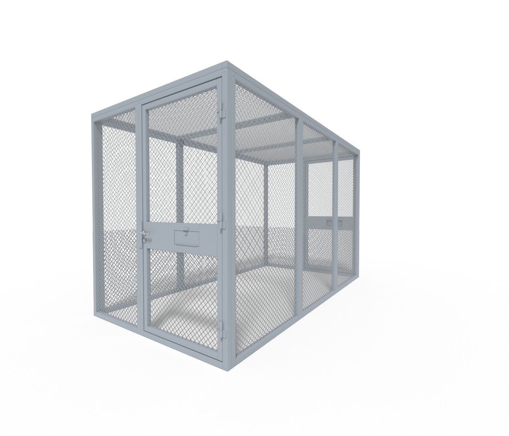
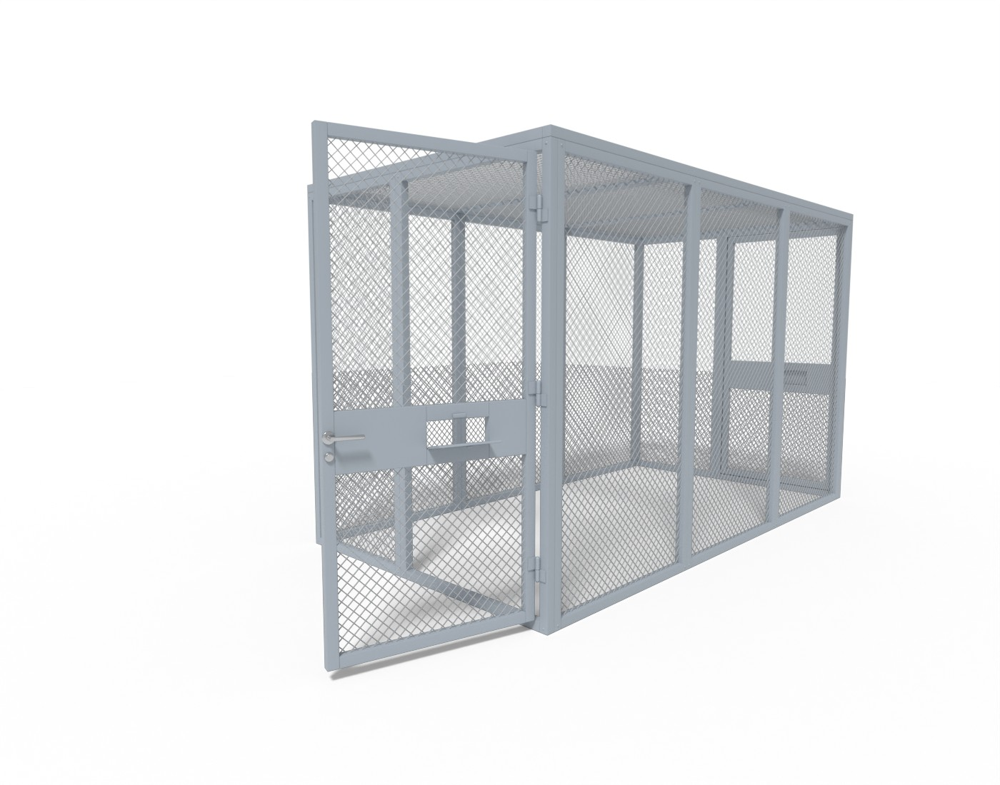

# To'rli metall qafas — Unity VR uchun 3D model

Rasmdagi modulli metall qafasning 3D modeli. Karkasi 50×50 mm kvadrat trubadan,
devorlari romb to'rdan, tomi kesib-cho'zilgan (expanded metal) to'rdan. Old va
orqa tomonda ilgakli eshik bor, eshikda qulf, tutqich va ovqat berish lyuki.




## Fayllar

| Fayl | Tavsif |
| --- | --- |
| `SecurityCage.fbx` | Asosiy model (tekstura shart emas, ranglar materialda) |
| `preview_front.jpg`, `preview_open.jpg` | Render ko'rinishlari |
| `generate_cage.py` | Modelni qayta yaratuvchi Blender skripti |

## Model parametrlari

- O'lcham: **2.0 × 3.7 m**, balandligi **2.3 m**; 1 unit = 1 metr.
- Unity'da barcha obyektlarda rotation `0,0,0`, scale `1,1,1`. Pivot polda, qafas markazida.
- 33 088 uchburchak, 3 ta material. To'r haqiqiy geometriya (alpha-tekstura emas), shuning
  uchun VR'da yaqindan ham hajmli ko'rinadi va shaffoflik saralash muammosi yo'q.
- Ierarxiya:
  - `SecurityCage`
    - `Cage_Frame`, `Cage_WallMesh`, `Cage_RoofMesh` — qo'zg'almas qismlar
    - `Door_Front` → `Door_Front_Handle`, `Door_Front_Hatch`
    - `Door_Back` → `Door_Back_Handle`, `Door_Back_Hatch`
- Eshik pivoti ilgak o'qida, tutqich pivoti o'q (spindle) markazida, lyuk pivoti pastki ilgagida.

## Ranglar (rasmdan o'lchangan)

| Material | Rang | Unity'da tavsiya |
| --- | --- | --- |
| `Cage_Paint_BlueGrey` — karkas, plita, ilgaklar | `#A0A9B2` ko'kimtir kulrang | Metallic 0, Smoothness 0.55 |
| `Cage_Mesh_Galvanized` — devor va tom to'ri | `#A9ACAF` neytral kulrang | Metallic 0, Smoothness 0.6 |
| `Cage_Steel_Stainless` — tutqich, qulf, vintlar | `#C8CACC` | Metallic 1, Smoothness 0.75 |

Ranglar **Linear** color space'da (URP/HDRP va VR shablonlarida standart) to'g'ri import
bo'ladi. Loyiha Gamma'da bo'lsa, Base Color'ga yuqoridagi HEX qiymatni qo'lda kiriting.

## Rasmdagi xatolar va ular qanday tuzatildi

1. Yon devorning birinchi bo'limida pastki qismda to'r yo'q edi → barcha devorlar to'liq to'r bilan yopildi.
2. Eshikning pastki qismida to'rsiz ochiq joy bor edi → eshikning ikkala oynasi ham to'liq to'r.
3. Orqa devorda to'r zichligi va rangi boshqacha, to'q dog' bor edi → har bir yuza uchun bitta bir xil to'r.
4. To'rda ko'k-binafsha rangli shovqin nuqtalar bor edi → toza neytral rang, begona ranglarsiz.
5. Eshikdagi plita eshik ramkasiga (ustunga) o'tib ketgan edi, bunday eshik ochilmaydi → plita
   faqat eshik tabaqasida; ramkada alohida qulf qutisi (strike box) va 6 mm tirqish bor.
6. Ilgaklar tartibsiz joylashgan, eshik ularda aylana olmaydi → 3 ta ilgak (pastdan 25 sm,
   o'rtada, tepadan 25 sm), har birining pastki bo'g'imi ramkada, yuqorisi eshikda.
7. Lyukda ilgak ham, zasov ham yo'q edi → pastki ilgakli, zasovli, ochiladigan lyuk.
8. Perspektiva mos emas edi (chap devor, orqa devor, bo'limlar) → aniq to'g'ri burchakli
   geometriya: old/orqa 0.9 + 1.1 m, yon tomonlar 3 × 1.2 m.
9. Orqa devordagi ma'nosiz vertikal tirqish olib tashlandi; orqa eshik oldingisi bilan bir xil qilindi.

## Unity'ga import qilish

1. `SecurityCage.fbx` ni `Assets/` ichiga tashlang.
2. **Model** tabida `Convert Units` ✔ (standart). VR'da o'tib ketmaslik uchun **`Generate Colliders` ✔**.
   Unumdorlik uchun yaxshirog'i: devorlarga `BoxCollider` qo'shib, to'rdagi mesh collider'ni o'chiring.
3. Qo'zg'almas qismlarni (`Cage_Frame`, `Cage_WallMesh`, `Cage_RoofMesh`) **Static** qiling. Eshiklar static bo'lmasin.

### Eshik, lyuk va tutqichni harakatlantirish

Burchaklar Unity'ning local o'qlari bo'yicha. Ular hisob-kitob bilan chiqarilgan, Unity'da sinab
ko'rilmagan. Qism teskari tomonga aylansa, ishorasini almashtiring.

| Obyekt | O'q | Yopiq → ochiq |
| --- | --- | --- |
| `Door_Front` | Y | 0 → −90 (tashqariga) |
| `Door_Back` | Y | 0 → +90 (tashqariga) |
| `Door_Front_Hatch` | X | 0 → +85 (pastga, tashqariga) |
| `Door_Back_Hatch` | X | 0 → −85 |
| `Door_*_Handle` | Z | 0 → +30 (tutqichni bosish) |

XR Interaction Toolkit uchun: eshikka `Rigidbody` + `HingeJoint` qo'shing.
Sozlamalar: `Anchor (0,0,0)`, `Axis (0,1,0)`, `Use Limits` ✔. Old eshik uchun chegara −90…0,
orqa eshik uchun 0…90. So'ng eshikka `XR Grab Interactable` qo'shing.

## Qayta generatsiya qilish

Skript boshidagi o'lchamlar (`FRONT_FIXED`, `DOOR_BAY`, `SIDE_PANEL`, `N_SIDE`, `H_WALL`),
to'r o'lchami (`WIRE_PITCH`, `WIRE_R`) va ranglar (`PAINT_HEX`, `MESH_HEX`, `STEEL_HEX`) o'zgartiriladi:

```bash
pip install bpy==4.2.0
python3 generate_cage.py --render        # FBX + preview rasmlar
```
