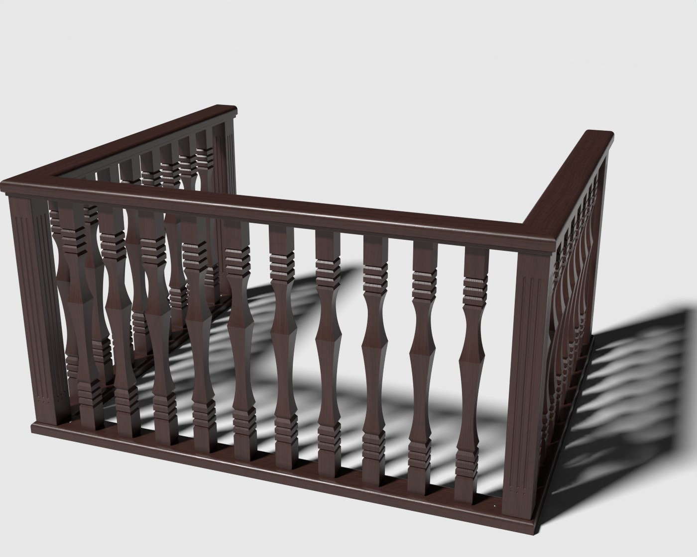

# Yog'och panjara (balyustrada) — Unity VR uchun 3D model

Rasmdagi U-shaklidagi yog'och panjaraning 3D modeli: kvadrat kesimli, halqali
balyasinalar, kanavkali (fluted) ustunlar, burchaklari 45° da ulangan tutqich
va pastki taglik reykasi.



## Fayllar

| Fayl | Tavsif |
| --- | --- |
| `WoodenRailing.fbx` | Asosiy model (teksturalar ichiga joylangan) |
| `Textures/Wood_Cherry_BaseColor.jpg` | Yog'och rangi (albedo), 2048×2048, tile qilinadi: asosiy rang `#4A2F2A`, tolalar `#331F19` |
| `Textures/Wood_Cherry_Normal.png` | Normal map (OpenGL / Unity formati) |
| `preview_front.jpg`, `preview_back.jpg` | Render ko'rinishlari |
| `generate_railing.py` | Modelni qayta yaratuvchi Blender skripti |

## Model parametrlari

- O'lcham: **1.835 × 1.529 m**, balandligi **0.95 m**; 1 unit = 1 metr.
- Y o'qi yuqoriga, Unity'da rotation `0,0,0`, scale `1,1,1` bo'lib ochiladi.
- Pivot: polda, modelning markazida.
- ~26 300 uchburchak, 2 ta material (`Wood_Cherry`, `Metal_Screw`) — VR (Quest ham) uchun yengil.
- Obyektlar: `WoodenRailing` → `Handrail`, `BaseRail`, `Posts`, `Balusters`, `Screws`.
- Balyasinalar orasidagi bo'shliq 9.5 sm (xavfsizlik me'yori < 10 sm).

## Unity'ga import qilish

1. `WoodenRailing.fbx` ni (xohlasangiz `Textures` papkasi bilan birga) `Assets/` ichiga tashlang.
2. FBX ni tanlang → **Inspector → Model**:
   - `Convert Units` ✔ (standart), `Scale Factor` = 1.
   - VR'da qo'l/teleport panjaradan o'tib ketmasligi uchun **`Generate Colliders` ✔**.
   - Lightmap bake qilsangiz: `Generate Lightmap UVs` ✔.
3. **Materials** tabida teksturalar avtomatik ulanadi. Materialni tahrirlash uchun
   `Extract Textures…` va `Extract Materials…` tugmalarini bosing.
   - URP/HDRP: materiallar pushti bo'lsa — *Window → Rendering → Render Pipeline Converter*
     (yoki `Wood_Cherry` shaderini `Universal Render Pipeline/Lit` ga almashtiring).
   - Tavsiya: `Wood_Cherry` → Smoothness ≈ 0.6, Normal Map = `Wood_Cherry_Normal`
     (tekstura turi *Normal map*); `Metal_Screw` → Metallic 1, Smoothness 0.7.
4. Sahnaga qo'ygandan keyin obyektni **Static** deb belgilang (batching va yorug'lik uchun).

## Qayta generatsiya qilish (o'lcham/balyasina sonini o'zgartirish)

Skript boshidagi o'zgaruvchilar (`H`, `N_FRONT`, `N_SIDE`, `GAP`, `BAL_W`, ranglar uchun `WOOD_LIGHT` / `WOOD_DARK` …) ni o'zgartiring:

```bash
pip install bpy==4.2.0 numpy pillow
python3 generate_railing.py --render        # FBX + teksturalar + preview
# yoki: blender -b -P generate_railing.py -- --render
```
