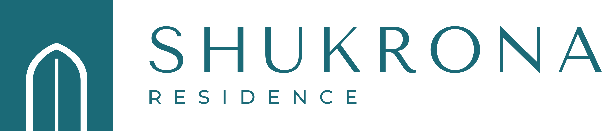

# SHUKRONA RESIDENCE — logotip



Yangi turar joy majmuasi uchun zamonaviy, premium va ishonch uyg‘otuvchi logotip.
To‘liq qo‘llanma (raqobatchilar tahlili, konsepsiya, qoidalar, maketlar):
**[05_brandbook/Shukrona_Residence_Brandbook.pdf](05_brandbook/Shukrona_Residence_Brandbook.pdf)**

---

## Konsepsiya: «Ostona»

> Uy ostonasi — shukronalik boshlanadigan joy.

| Element | Ma’nosi |
|---|---|
| **Peshtoq** — to‘g‘ri burchakli blok | Registon peshtoqlari ramkasi. Mustahkamlik, himoya, monolit qurilish → *ishonch* |
| **Temuriy ravoq** — yumshoq uchli ravoq | O‘zbek me’morchiligining taniqli belgisi. Tom ham, minora ham emas → *o‘ziga xoslik* |
| **Nur chizig‘i** — eshik atrofidagi oq chiziq | Xonadondan taralayotgan iliqlik → *shukronalik* |
| **Ikki tavaqali eshik** | An’anaviy o‘ymakor eshiklar: oila va mehmondo‘stlik → *oila, xonadon* |
| **Petrol-firuza #1B6A77** | Samarqand firuza koshinining chuqur, zamonaviy talqini → *tinchlik, premium* |

**Tipografiya:** SHUKRONA — *Tenor Sans* (nafis gumanistik grotesk, harf oralig‘i +140);
RESIDENCE — *Montserrat Medium* (bosh harflar, harf oralig‘i +600). Ikkala shrift bepul (SIL OFL).

## Raqobatchilar tahlili — qisqacha

- Toshkentda «… Residence» nomli majmualar juda ko‘p (Bobur, Baku, Depo, Darxan, Zilan, Stellar, Agalarov Residence va b.),
  shuning uchun urg‘u **SHUKRONA** so‘ziga berildi, RESIDENCE — kichik yordamchi qator.
- Toifada takrorlanuvchi klishelar: osmono‘par siluetlari, uy tomi («chevron»), oltin + qora «lyuks» palitra,
  bitta harfli monogramma, Trajan/Cinzel uslubidagi antikva, gradientlar.
- Shukrona yechimi: **milliy me’morchilik kodi + zamonaviy minimalizm**, bitta sokin rang, ma’noli belgi.
  Bu pozitsiya — «milliy, iliq, lekin premium» — raqobatchilar tomonidan band qilinmagan.

Batafsil jadval va pozitsiyalash xaritasi — brendbukning 3-sahifasida.

## Fayllar

| Papka | Nima uchun | Formatlar |
|---|---|---|
| `00_DOWNLOAD/` | Bir bosishda yuklab olish: barcha AI fayllar va to‘liq to‘plam | ZIP |
| `01_MASTER/` | Barcha 16 versiya bitta artbordda, har biri alohida qatlamda | AI · EPS · PDF (RGB va CMYK) · SVG |
| `02_vector_RGB/` | Ekran: Instagram, sayt, taqdimot | SVG · AI · EPS · PDF |
| `03_vector_CMYK_print/` | Bosma: banner, xonadon kartochkasi, buklet | AI · EPS · PDF (CMYK) |
| `04_PNG/` | Tayyor rasm (shaffof fon) va Instagram avatar 1080×1080 | PNG |
| `05_brandbook/` | Logotip qo‘llanmasi | PDF |
| `source/` | Generator skriptlari va shriftlar | Python · TTF |

**Fayl nomi:** `shukrona_[kompozitsiya]_[rang]`
- kompozitsiya: `horizontal` (asosiy), `vertical`, `icon` (belgi), `wordmark` (yozuv)
- rang: `petrol` (asosiy), `inverse` (petrol fonda oq), `black`, `white` (to‘q fon/foto uchun)

### Adobe Illustrator
`.ai` fayllar PDF asosida (Illustrator CS va yangiroq versiyalar bilan mos) — to‘g‘ridan-to‘g‘ri **File → Open** bilan ochiladi;
barcha shakllar tahrirlanadigan vektor kontur, qatlamlar nomlangan (`Belgi`, `SHUKRONA`, `RESIDENCE`, `Fon`).
Illustrator’ning o‘z formatida saqlash uchun: **File → Save As → Adobe Illustrator (.ai)**.

### CorelDRAW
**File → Import (Ctrl+I)** orqali `.ai`, `.pdf`, `.eps` yoki `.svg` faylni oching.
EPS uchun **PostScript Interpreted** rejimini tanlang — barcha shakllar egri chiziq (curves) sifatida tahrirlanadi.
Keyin **Save As → CDR** bilan CorelDRAW formatida saqlang.

### Matn
Barcha yozuvlar konturga aylantirilgan — shrift o‘rnatilmagan kompyuterda ham logotip buzilmaydi.
Matnni qayta terish kerak bo‘lsa, shriftlar: `source/fonts/`.

## Ranglar

| Rang | HEX | RGB | CMYK |
|---|---|---|---|
| **Petrol-firuza** (asosiy) | `#1B6A77` | 27 · 106 · 119 | 88 · 36 · 34 · 14 |
| Chuqur petrol | `#0F4A54` | 15 · 74 · 84 | 94 · 39 · 34 · 47 |
| Qum (aksent) | `#C9AE85` | 201 · 174 · 133 | 22 · 30 · 52 · 0 |
| Fil suyagi | `#F5F1EA` | 245 · 241 · 234 | 2 · 4 · 7 · 0 |
| Tuman | `#DCE9E8` | 220 · 233 · 232 | 12 · 3 · 8 · 0 |

CMYK qiymatlari ICC profil (Coated) orqali Lab bo‘yicha eng yaqin moslik sifatida hisoblangan —
bosmadan oldin bosmaxonada sinov nusxasi (proof) bilan tasdiqlang.

## Asosiy qoidalar

- **Himoya maydoni:** x = belgi kengligining yarmi; logotip atrofida kamida x bo‘sh joy.
- **Minimal o‘lcham:** gorizontal 35 mm / 140 px · vertikal 22 mm / 100 px · belgi 7 mm / 24 px.
- Cho‘zmang, burmang, rangini o‘zgartirmang, soya/effekt qo‘shmang, tartibsiz fonga qo‘ymang, shriftni almashtirmang.

## Qayta yaratish

Barcha fayllar bitta manbadan generatsiya qilinadi (geometriyani o‘zgartirish — `source/build_logo.py`):

```bash
pip install fonttools uharfbuzz cairosvg
cd source
python3 build_logo.py        # 01–04 papkalar
python3 build_brandbook.py   # 05_brandbook (Chromium kerak; CHROME=/yo‘l/chrome)
```
